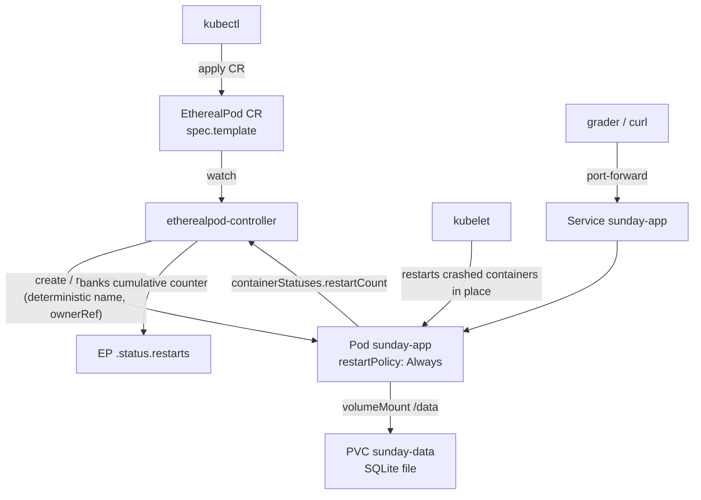

# EtherealPod Operator + SundayApp

Two components in one repository:

- **EtherealPod** — a namespaced CRD (`etherealpods.workload.sunday.io/v1alpha1`, short name `eps`) and a kubebuilder-v4 operator that guarantees **exactly one running pod** per CR, self-heals it, and reports a **cumulative restart counter** that survives pod recreation and operator restarts.
- **SundayApp** — a small groceries HTTP API (Go + SQLite on a PVC) that never loses data, deployed *as an EtherealPod* to demonstrate the operator end to end.

## How to run

Prerequisites: `docker`, `kubectl`, `kind` (the script checks and tells you what is missing; nothing is auto-installed).

```bash
./requirements.sh
```

The script creates a kind cluster named `sunday` (idempotent), builds both images locally, loads them into the cluster, applies `submission.yaml` (twice, with a wait for CRD establishment in between — see assumptions), and waits for the operator to become Available.

Manual equivalent:

```bash
kind create cluster --name sunday
docker build -t etherealpod-operator:v0.1.0 operator/
docker build -t sunday-app:v0.1.0 sundayapp/
kind load docker-image etherealpod-operator:v0.1.0 --name sunday
kind load docker-image sunday-app:v0.1.0 --name sunday
kubectl apply -f submission.yaml
kubectl wait --for=condition=Established crd/etherealpods.workload.sunday.io
kubectl apply -f submission.yaml
```

On minikube: replace the kind commands with `minikube start` and `minikube image load <image>`; everything else is identical (the default hostPath provisioner backs the PVC).

## Architecture



**Exactly one pod.** The managed pod's name equals the CR name, so the API server's uniqueness constraint — not the informer cache — enforces the singleton (the same idea StatefulSet uses). A pod with the same name that the operator does not own is never adopted or deleted; the CR reports a `NameConflict` condition instead.

**Self-healing is split.** In-place container crashes are restarted by the kubelet (`restartPolicy` is forced to `Always`); pod deletion and terminal phases (`Failed`/`Succeeded`, eviction, node loss) are handled by the controller, which deletes and recreates. A terminating pod is never force-deleted — the controller waits for the name to free up.

**RESTARTS accounting.** `containerStatuses[].restartCount` resets to zero when a pod is recreated (new UID), so the controller banks a cumulative counter in `.status`, keyed to pod-UID transitions. The accounting is level-based and idempotent: every reconcile re-derives state from what it observes, never "read counter, add 1" per event. Each pod replacement counts as one restart plus whatever the vanished pod had accumulated.

```
$ kubectl get eps
NAME         AGE   RESTARTS
example-ep   10m   3
```

**SundayApp durability.** SQLite (pure-Go driver, WAL journal, `synchronous=FULL`) on a PVC: every commit is on disk before the HTTP response returns, so data survives container crashes, pod deletion, and node restarts. A single DB connection makes the lone replica race-free.

## SundayApp API

All parameters are query parameters. `user_id` and `product_name` must match `^[a-z]+$`; `amount` is an integer in `1..1000000`. Violations return `400 {"error":...}`; a wrong method returns 405.

| Endpoint | Success | Errors |
|---|---|---|
| `POST /write?user_id=loki&product_name=apple&amount=1` | `200 {"user_id":"loki","product_name":"apple","amount":<new user total>}` (repeat writes increment) | 400 |
| `GET /get_product_amount?product_name=apple` | `200 {"product_name":"apple","amount":<sum across users>}` | 400, 404 if absent |
| `DELETE /delete_product?product_name=beer` | `200 {"deleted":"beer"}` (removes it for all users) | 400, 404 if absent |
| `GET /healthz` | `200 ok` (liveness/readiness probe) | — |
| `POST /crash` | `200 {"crashing":true}`, then the process exits with code 2 (restart demo) | — |

## Demo

```bash
# Restart counting on a minimal EtherealPod
kubectl apply -f deploy/demo-ep.yaml
kubectl get eps                                   # RESTARTS 0
kubectl exec example-ep -- pkill sleep            # crash the container
kubectl get eps                                   # RESTARTS 1 (kubelet restart)
kubectl delete pod example-ep                     # delete the whole pod
kubectl get eps                                   # RESTARTS 2 (controller recreated it)

# SundayApp: data survives crashes and recreation
kubectl -n sunday port-forward svc/sunday-app 8080:80 &
curl -X POST 'http://localhost:8080/write?user_id=loki&product_name=apple&amount=1'
curl -X POST 'http://localhost:8080/write?user_id=thor&product_name=apple&amount=2'
curl 'http://localhost:8080/get_product_amount?product_name=apple'   # amount: 3
curl -X POST http://localhost:8080/crash          # pod restarts...
curl 'http://localhost:8080/get_product_amount?product_name=apple'   # ...amount still 3
```

## Assumptions and decisions

- **"Restart" definition**: the RESTARTS column counts kubelet container restarts **plus** full pod replacements (each replacement is +1 on top of what the dead pod had accumulated). This matches the intuitive reading "the managed pod restarted N times".
- **GET sums across users**: "amount of product X" with per-user rows only makes sense aggregated; an absent product is `404`, distinct from a stored 0 (which cannot exist — amounts are positive).
- **Repeat POST increments** the user's amount ("add products to a list" semantics) and returns that user's new total.
- **DELETE removes the product for all users** — the endpoint takes no user parameter, which forces that reading.
- **"Never lose data"** means data survives application crashes and pod deletion/recreation (PVC + synchronous SQLite commits) — not deletion of the cluster or the PVC itself.
- **Restart policy is forced to `Always`** on managed pods regardless of the template: the self-heal contract is non-negotiable.
- **Pinned image tags + `imagePullPolicy: IfNotPresent`** everywhere: images are built locally and loaded into kind; `:latest` would make the kubelet try to pull from a registry that does not have them.
- **`submission.yaml` is applied twice** by `requirements.sh`: the CRD and a CR of its kind live in the same file, and the first apply can race CRD establishment. The double apply (idempotent) with a `kubectl wait` in between is the simplest robust fix.
- **Template drift handling (bonus)**: editing `spec.template` replaces the managed pod (tracked via a template-hash annotation); the replacement counts as a restart.
- No webhooks and single operator replica: cert-manager and HA add weight without assignment value.

## Repository map

```
operator/    kubebuilder project: EtherealPod CRD types, controller, envtest suite
sundayapp/   Go HTTP API + SQLite store (+ Dockerfile)
deploy/      SundayApp manifests (PVC + EtherealPod + Service) and a demo CR
submission.yaml   single-file install: namespaces, CRD, RBAC, operator, SundayApp
requirements.sh   bootstrap: checks tools, kind cluster, image builds, apply, wait
```

## Development

```bash
cd operator && make test lint    # envtest suite + golangci-lint
cd sundayapp && go test -race ./...
```
